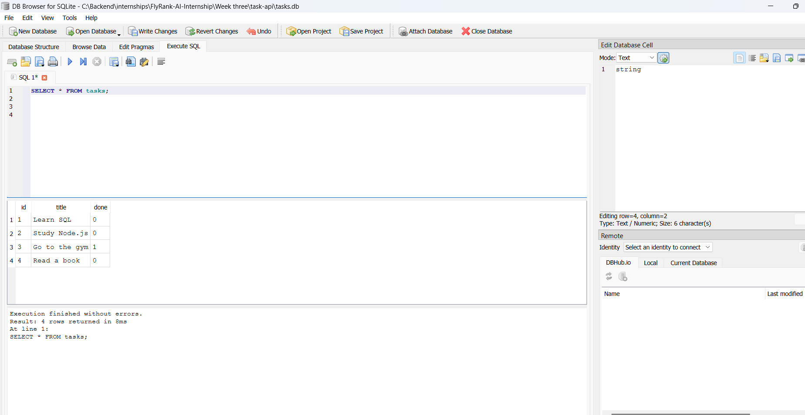

````markdown
# Task Management REST API (SQLite Version)

A simple RESTful CRUD API built with **Node.js**, **Express.js**, and **SQLite** for managing tasks.

This project was created as part of the **FlyRank Backend Internship – Week 3 Assignment**.

The API stores tasks in an **SQLite** database using **better-sqlite3**, supports full CRUD operations, includes task filtering and searching features, and is documented using **Swagger UI**.

Unlike the previous in-memory implementation, task data is now persisted in a local database, so it survives server restarts.

---

# Features

## Core Features

- Create a task
- Get all tasks
- Get a task by ID
- Update a task
- Delete a task
- Input validation
- Proper HTTP status codes
- Persistent SQLite database
- Swagger UI documentation

## Extra Features

### Filter tasks by completion status

Example:

```http
GET /tasks?done=true
```

Returns only completed tasks.

### Search tasks by title

Example:

```http
GET /tasks?search=milk
```

Returns tasks whose title contains the search text.

### Combine filters together

Example:

```http
GET /tasks?done=false&search=milk
```

Returns tasks matching both conditions.

---

# Technologies Used

- Node.js
- Express.js
- SQLite
- better-sqlite3
- Swagger UI Express
- OpenAPI 3.1

---

# Why SQLite?

SQLite was chosen because it is a lightweight, serverless database that stores all data in a single file.

For this project it provides several advantages:

- No database server installation or configuration.
- Stores all data in a single `tasks.db` file.
- Data persists after restarting the server.
- Fast and easy to use for small backend applications.
- Perfect for learning SQL and database fundamentals.

---

# Installation

Clone the repository:

```bash
git clone <your-repository-url>
```

Move into the project folder:

```bash
cd Task-API
```

Install dependencies:

```bash
npm install
```

---

# Running the Project

Start the development server:

```bash
npm run dev
```

The server will start on:

```
http://localhost:3000
```

Swagger UI:

```
http://localhost:3000/docs
```

---

# Database

The application automatically creates a local SQLite database named:

```
tasks.db
```

The database file is created automatically the first time the application runs if it does not already exist.

The database stores all tasks permanently, meaning data survives server restarts.

Typically, `tasks.db` is added to `.gitignore` so each developer starts with a fresh local database after cloning the repository.

---

# API Endpoints

| Method | Endpoint | Description |
|---------|----------|-------------|
| GET | /tasks | Get all tasks |
| GET | /tasks/:id | Get a task by ID |
| POST | /tasks | Create a new task |
| PUT | /tasks/:id | Update a task |
| DELETE | /tasks/:id | Delete a task |
| GET | /tasks?done=true | Filter tasks by completion status |
| GET | /tasks?search=word | Search tasks by title |

---

# Example cURL Request

```bash
curl -i -X POST http://localhost:3000/tasks \
-H "Content-Type: application/json" \
-d "{\"title\":\"Buy milk\"}"
```

Example response:

```http
HTTP/1.1 201 Created

{
  "message": "the task created successfully",
  "data": {
    "id": 4,
    "title": "Buy milk",
    "done": 0
  }
}
```

---

# Filtering and Searching Examples

## Filter completed tasks

```bash
curl -i "http://localhost:3000/tasks?done=true"
```

---

## Search tasks

```bash
curl -i "http://localhost:3000/tasks?search=milk"
```

---

## Apply multiple filters

```bash
curl -i "http://localhost:3000/tasks?done=false&search=milk"
```

---

# Swagger UI

Swagger documentation is available at:

```
http://localhost:3000/docs
```

---

# Example SQL Query

Example query executed in **DB Browser for SQLite** during Stage 4:

```sql
SELECT *
FROM tasks
WHERE done = 1;
```

This query returns all completed tasks stored in the database.

---

## Database Screenshot

The screenshot below shows the SQLite database opened in **DB Browser for SQLite** while executing SQL queries on the `tasks.db` database.



---

# Project Structure

```text
.
├── controller
├── routes
├── database.js
├── schema.sql
├── tasks.db
├── app.js
├── index.js
├── openapi.json
├── package.json
├── README.md
└── images
    └── db-browser.png
```

---

# Notes

- Task data is stored in a local SQLite database (`tasks.db`).
- The database is created automatically if it does not already exist.
- Data persists after restarting the server.
- SQLite queries are executed using **better-sqlite3**.
- Filtering and searching are implemented using SQL queries and query parameters.
- API documentation is available through Swagger UI.

---

# Future Improvements

Some possible future enhancements include:

- Add pagination for large task lists.
- Add task categories and priorities.
- Add authentication and user accounts.
- Add automated tests.
- Replace SQLite with PostgreSQL for production deployments.
````
